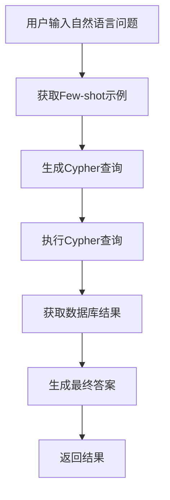
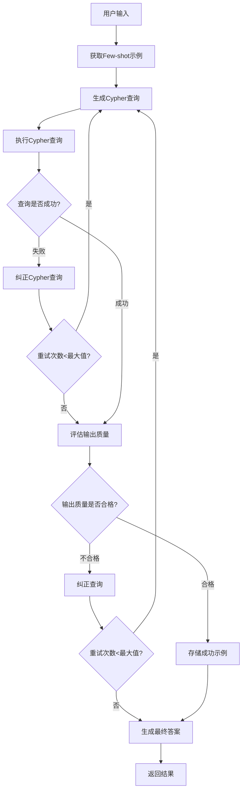
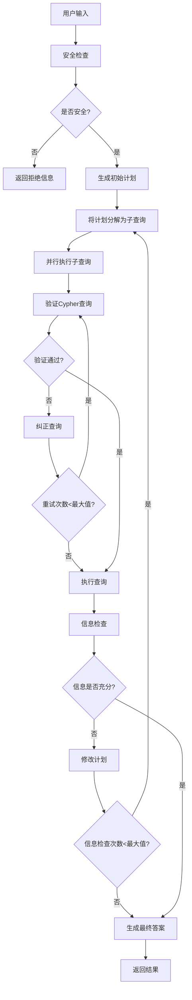

# Text2Cypher 项目推理逻辑流程说明

## 概述

这个项目是一个基于大语言模型的自然语言到Cypher查询转换系统，使用llama-index的workflow架构实现。系统能够将用户的自然语言问题转换为Neo4j的Cypher查询，执行查询并返回结果。

## 系统架构

### 1. 核心组件

- **应用入口** (`app/main.py`): FastAPI应用，提供Web界面和API
- **资源管理器** (`app/resource_manager.py`): 管理LLM模型和数据库连接
- **工作流引擎** (`cypher_workflows/`): 实现不同的推理流程

### 2. 工作流类型

项目支持4种不同的工作流：

1. **naive_text2cypher** - 基础流程
2. **naive_text2cypher_with_1_retry** - 带重试的基础流程
3. **text2cypher_with_1_retry_and_output_check** - 带重试和输出检查的流程
4. **iterative_planning** - 迭代规划流程（已注释）

## 详细推理流程

### 1. 基础流程 (naive_text2cypher)

**核心步骤：**

1. **Few-shot检索**: 从本地parquet文件中检索相似的问题-查询对
2. **Cypher生成**: 使用LLM根据schema和few-shot示例生成Cypher查询
3. **查询执行**: 在Neo4j数据库中执行生成的Cypher查询
4. **结果汇总**: 使用LLM将查询结果转换为自然语言答案

### 2. 带重试和输出检查的流程 (text2cypher_with_1_retry_and_output_check)

**核心特性：**

1. **错误处理**: 捕获Cypher语法错误和执行错误
2. **智能重试**: 基于错误信息自动纠正查询
3. **输出质量评估**: 评估查询结果是否充分回答了问题
4. **自学习**: 将成功的查询保存为新的few-shot示例

### 3. 迭代规划流程 (iterative_planning)

**核心特性：**

1. **计划分解**: 将复杂问题分解为多个子查询
2. **并行处理**: 同时执行多个子查询提高效率
3. **动态调整**: 根据查询结果动态调整执行计划
4. **综合推理**: 整合多个查询结果生成最终答案

## 关键技术组件

### 1. Few-shot学习管理

- **LocalFewshotManager**: 从本地parquet文件加载示例
- **Neo4jFewshotManager**: 将成功的查询保存到Neo4j图数据库
- **向量检索**: 使用embedding模型检索相似示例

### 2. Schema管理

- **动态Schema获取**: 从Neo4j数据库实时获取schema信息
- **Schema过滤**: 排除特定类型的节点（如Actor, Director）
- **关系校正**: 使用CypherQueryCorrector修正关系方向

### 3. 错误处理与重试

- **语法错误检测**: 使用EXPLAIN检查Cypher语法
- **执行错误捕获**: 捕获运行时错误
- **智能纠错**: 基于错误信息生成修正建议

### 4. 质量评估

- **输出评估**: 评估查询结果是否充分回答问题
- **结果过滤**: 限制结果数量（最多100条）
- **格式化输出**: 将结构化结果转换为自然语言

## 配置参数

### 1. 重试限制

- `max_retries`: 最大重试次数（通常为1-2次）
- `MAX_CORRECT_STEPS`: 最大纠错步骤数
- `MAX_INFORMATION_CHECKS`: 最大信息检查次数

### 2. 性能优化

- `timeout`: 数据库连接超时时间（30秒）
- `num_workers`: 并行工作线程数（4个）
- `enhanced_schema`: 启用增强schema功能

### 3. 模型配置

- **LLM模型**: 支持OpenAI、Anthropic、Gemini、Mistral等
- **Embedding模型**: 使用OpenAI text-embedding-3-small
- **温度设置**: 通常设为0以获得确定性输出

## 数据流

1. **用户输入** → Web界面/API
2. **请求处理** → FastAPI路由
3. **工作流选择** → 根据用户选择初始化相应工作流
4. **模型调用** → 使用配置的LLM模型
5. **数据库操作** → Neo4j查询执行
6. **结果返回** → 流式响应给用户

## 扩展性

系统设计具有良好的扩展性：

1. **新工作流**: 可以轻松添加新的推理流程
2. **新模型**: 支持添加新的LLM提供商
3. **新数据库**: 可以支持多个Neo4j数据库实例
4. **新功能**: 模块化设计便于添加新功能

## 总结

这个系统通过多层次的推理流程，实现了从自然语言到Cypher查询的高质量转换，具有错误处理、自学习和质量评估等高级功能，能够满足复杂的图数据库查询需求。 